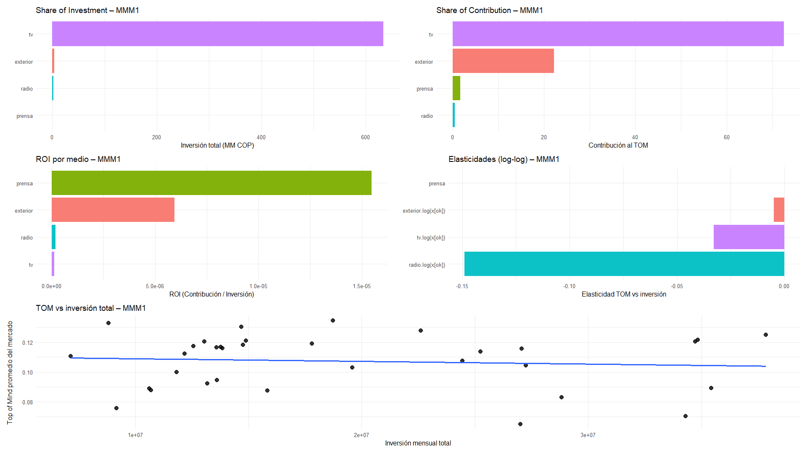
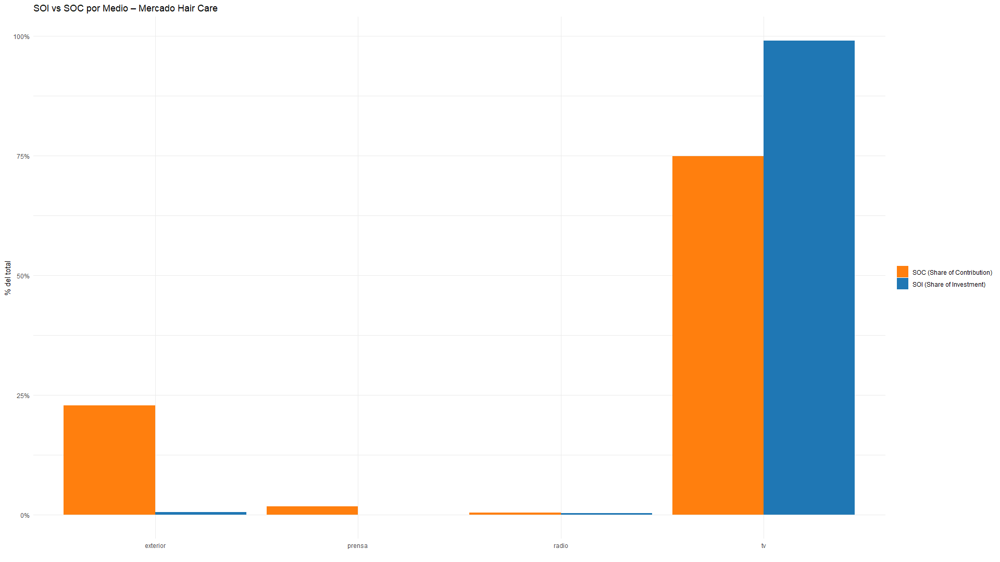
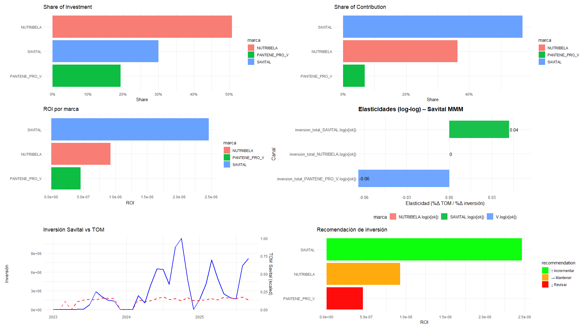
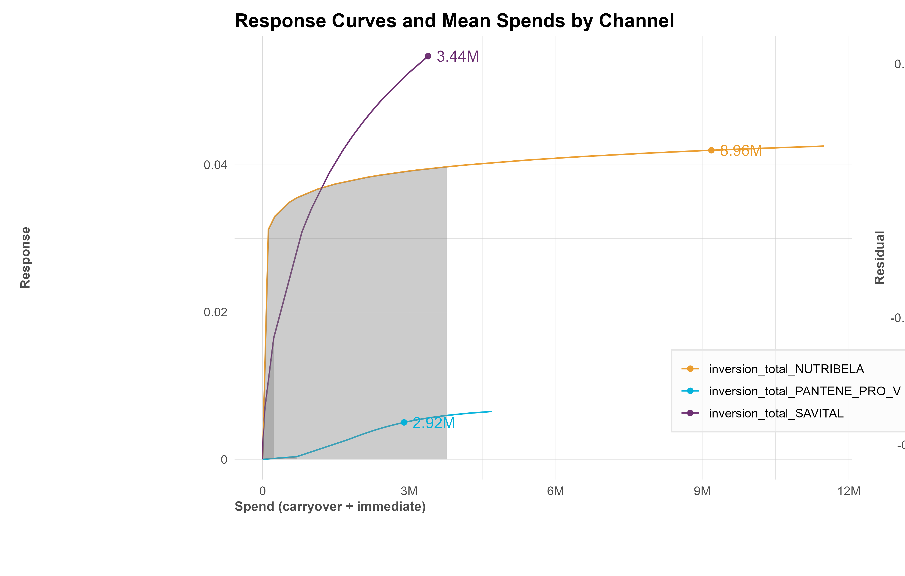

# Marketing Mix Modeling — Categoría Capilar Colombia (Savital / Robyn)

> Proyecto académico desarrollado en la **Universidad Externado de Colombia** como parte del programa de Marketing. Aplica econometría bayesiana para cuantificar el impacto de la inversión en medios sobre el Top of Mind de marcas en la categoría capilar del mercado colombiano.

---

## Problema de negocio

La categoría capilar en Colombia concentra su inversión publicitaria en pocos canales, principalmente televisión, sin evidencia cuantitativa sobre la eficiencia de cada peso invertido. Las marcas compiten por posicionamiento de marca (Top of Mind) sin un modelo que permita asignar presupuesto con base en datos.

**Pregunta central:** ¿Qué medios generan mayor retorno en términos de Top of Mind por peso invertido?

---

## Objetivo

Construir un Marketing Mix Model (MMM) que cuantifique la contribución de cada canal de medios al Top of Mind de la categoría y de la marca Savital, para formular recomendaciones de reasignación presupuestal basadas en evidencia econométrica.

---

## Datos

- **Periodo:** enero 2023 – septiembre 2025 (33 meses)
- **Marcas analizadas:** Savital, Pantene Pro-V, NutriBela
- **Canales de medios:** TV Nacional, TV Regional, TV por Suscripción, Radio, Prensa, Publicidad Exterior
- **Variables de marca:** Top of Mind (TOM), Awareness
- **Fuente:** Datos de inversión publicitaria y métricas de marca de un caso académico real

> **Nota sobre los datos:** Los datos originales son confidenciales (caso académico con Unilever). Este repositorio **no incluye los datos reales**. En su lugar, encontrarás un dataset sintético de demostración en [`data_example/data_example.csv`](data_example/data_example.csv) que replica la estructura del modelo para que el código sea ejecutable. Los valores son simulados y no representan la realidad del mercado.

---

## Metodología

### Modelo 1 — Modelo de Categoría (MMM1)

Modela el Top of Mind **promedio del mercado capilar** como función de la inversión total por canal (TV, Radio, Prensa, Publicidad Exterior) y variables de contexto (Awareness, Personas alcanzadas).

```
TOM_mercado ~ f(tv, radio, prensa, exterior, awareness, personas)
```

### Modelo 2 — Modelo Competitivo (MMM2)

Modela el Top of Mind de **Savital** en función de la inversión de las tres marcas directas, controlando por el TOM y Awareness de los competidores (Pantene Pro-V y NutriBela).

```
TOM_Savital ~ f(inv_Savital, inv_Pantene, inv_NutriBela,
                awareness_Pantene, awareness_NutriBela,
                TOM_Pantene, TOM_NutriBela)
```

**Especificación técnica:**
- Librería: [Robyn](https://facebookexperimental.github.io/Robyn/) (Meta Open Source)
- Adstock: transformación geométrica por canal
- Saturación: función Hill
- Optimización: Nevergrad (algoritmos evolutivos) — 1.500 iteraciones × 2 trials
- Selección de modelo: frontera de Pareto (nRMSE vs. DECOMP.RSSD)

---

## Herramientas

| Herramienta | Uso |
|---|---|
| R 4.x | Lenguaje principal |
| [Robyn](https://github.com/facebookexperimental/Robyn) | MMM framework (Meta) |
| ggplot2 | Visualizaciones |
| readxl / dplyr / tidyr | Procesamiento de datos |
| writexl | Exportación de resultados |
| patchwork | Composición de dashboards |

---

## Principales hallazgos

### Modelo de Categoría (MMM1)

| Canal | Share of Investment | Share of Contribution | Diagnóstico |
|---|---|---|---|
| Televisión | **99%** | **73%** | Sobreinvertido — rendimientos decrecientes |
| Publicidad Exterior | **0.6%** | **22%** | Subutilizado — mayor eficiencia por peso invertido |
| Radio | <1% | ~3% | Potencial sin explorar |
| Prensa | <1% | ~2% | Baja contribución marginal |

- La televisión concentra casi toda la inversión pero su contribución al TOM es desproporcionadamente menor.
- La publicidad exterior genera **22% del impacto con solo el 0.6% del gasto** — la mayor eficiencia de la categoría.

### Modelo Competitivo (MMM2)

- **Savital** es la única marca con **elasticidad de inversión positiva (+0.042)**, lo que indica que incrementos en su inversión aún generan crecimiento incremental en TOM.
- Pantene Pro-V y NutriBela muestran señales de saturación o rendimientos decrecientes.
- La inversión de competidores tiene efecto negativo sobre el TOM de Savital, confirmando la dinámica competitiva directa.

### Recomendación central

> Reasignar entre 5% y 10% del presupuesto actualmente destinado a TV hacia publicidad exterior y radio, priorizando los periodos de mayor elasticidad (Q2-Q3), podría incrementar el TOM de mercado sin aumentar el presupuesto total.

---

## Visualizaciones del modelo

<!-- Agrega aquí las imágenes de tu presentación -->
<!-- Ejemplo: -->
<!--  -->
<!--  -->
<!--  -->
<!--  -->

*Pendiente: agregar capturas de las gráficas de la presentación final.*

---

## Estructura del repositorio

```
MMM_Savital/
├── scripts/
│   └── mmm_Savital.R          # Script principal — modelos MMM1 y MMM2
├── data_example/
│   └── data_example.csv       # Dataset sintético de demostración (33 periodos)
├── images/
│   ├── mmm1/                  # Gráficas del modelo de categoría
│   └── mmm2/                  # Gráficas del modelo competitivo
├── data/                      # EXCLUIDO del repo — datos confidenciales locales
├── outputs/                   # EXCLUIDO del repo — outputs de Robyn
└── README.md
```

---

## Cómo ejecutar

### Requisitos

```r
install.packages(c("readxl", "dplyr", "janitor", "lubridate", "tidyr",
                   "ggplot2", "scales", "writexl", "patchwork"))

# Robyn (versión de desarrollo)
install.packages("Robyn")
```

### Pasos

1. Clona el repositorio:
   ```bash
   git clone https://github.com/TU_USUARIO/mmm-savital-robyn.git
   cd mmm-savital-robyn
   ```

2. Coloca tu archivo de datos real en `data/BASE.xlsx`, **o** adapta el script para leer el dataset sintético de demostración:
   ```r
   # En scripts/mmm_Savital.R, línea 11, cambia:
   df <- read_excel("data/BASE.xlsx") %>% clean_names()
   # Por (para demo):
   df <- read_csv("data_example/data_example.csv")
   ```

3. Abre RStudio y establece el directorio de trabajo en la raíz del proyecto:
   `Session → Set Working Directory → To Project Directory`

4. Ejecuta el script: `scripts/mmm_Savital.R`

> El script está organizado en secciones: **MMM1** (modelo de categoría), **MMM2** (modelo competitivo), y **visualizaciones**. Puedes correr cada sección de forma independiente.

---

## Contexto académico

Proyecto desarrollado en el curso de **Marketing II** — Universidad Externado de Colombia (2025).

El caso analiza la categoría de cuidado capilar en Colombia con datos reales de inversión publicitaria y métricas de marca. La metodología Robyn sigue los estándares de la industria para MMM utilizados por empresas como Meta, Google y Unilever globalmente.

---

## Autor

**Iosiv Ruiz**
Estudiante de Marketing — Universidad Externado de Colombia
[iosivruiz@gmail.com](mailto:iosivruiz@gmail.com)
